Pure4J For Financial Calculations
=================================

Pure4J is born from experience in the financial services sector (specifically, risk). We have 
to build lots of calculators, and it's hard to build tests that show you've got them right.  
If you are facing similar issues, this approach might help.

In this tutorial I am going to:
* Explain Value at Risk (as a simple financial calculation).
* Model an example of this on a spreadsheet.
* Use Pure4J to implement the Value at Risk model as pure, functional java code.
* Use [Concordion](http://concordion.org) and a Microsoft Excel example to build an automated functional test of the Java code.

We will cover each of these parts as we go along, and I will introduce all the concepts described
above.

But, the end result is that we will have:
* A pure functional, Java financial calculator, which can be embedded *anywhere we need it*.
* A Java functional test that demonstrates (and exercises) the calculator.
* Good code-coverage

### Why Excel? 

If you are used to writing tests, you'll know that they are often in the form:

* **Given** some inputs, A, B, C. 
* **When** I perform some operation, X
* **Then** I expect some result, R.

This is all very well if you know how to calculate R from A, B and C.  But, if the calculation
of R is complicated, you might well want to show your working out, and use some excel functions
to help you get it right.

Secondly, in the world of finance, it is often business analysts (BA's) who have to put together these example
calculations.   They are usually *very familiar* with Excel, and showing these calculations in Excel.

So, in order to *minimize friction* for the people writing tests, it's a good idea to use tools and formats
that they are already familiar with.

### Introduction To Historic Value At Risk

Value at Risk (henceforth, VaR) is a methodology which aims to answer the following question:

> Given a particular confidence interval (say 90% certainty), and a particular period of time, 
> what amount of money should I expect to lose?

So, if you have a 1-day, 90% VaR of $500, you should expect that on average, once in twenty 
days you will lose more than $500.  

This is a really useful calculation for banks to have:  it allows them to establish confidence
intervals on likely losses, and give them some information about how much to hold back for a
rainy day.

Even if you only just  got the gist of what was written above, that should be fine for the purposes 
of understanding the rest of this tutorial.  If you want a longer explanation, then 
[take a look at Bionic Turtle's video](https://www.youtube.com/watch?v=yiyqIEWieEQ).  To keep things
easy to follow, I will be doing essentially the same example here.

In any case, this is *a simplified* example: we're trying not to let too many details creep in and ruin 
the big picture.  (On a specific note, our VaR will not consider currencies, or any period other than 
one day.)

### What About the 'Historic' Part?

The 'Historic' part of the VaR tells us how we are going to calculate our VaR.  Specifically, 
we are going to look at the historic gains and losses of (in this case) a 
portfolio of stocks (or shares), and, assuming the market will do in the future what it has done
in the past, work out our VaR from these historic changes.

In real life, the past performance of the stock market is no indication of what the future performance
would be.  For now though, we'll let that concern go:  this is the 'Historic VaR' because it's telling
us what the VaR would have been through a particular period of the past.

### How Will It Work?

Let's look at an architecture diagram of how this test will work:


On the right side, we have the VaR model that we want to test.  To test it, we're going to call it with some
inputs, and get back it's output.  

On the left side, we have our test fixture, which consists of:
* The Excel Spreadsheet demonstrating the VaR calculation, to give us the inputs we need.
* Some Java Fixture code, knows how to call the VaR model.

In the middle, we have Concordion, which:
* Handles (by way of the Concordion Excel Extension) reading in the Excel spreadsheet.
* Calling the fixture code, and checking the actual results match the expected results.
* Producing an HTML report to show the results.

Hopefully this is somewhat clear, if not, keep reading as we put some detail on this picture.

### Building Our Excel Spreadsheet

We need four pieces of information to get started on VaR:

* The confidence interval (we are going to use 90%).
* The amount (in $) of each share in our portfolio.  This is called the *sensitivity* to that share.
* The historic movements (profits and losses) of some shares.  We are going to use 20 days' worth, and only 3 shares.
* The period over which we are measuring VaR (we are going to use 1 day).

Let's first model those first two items in Excel:

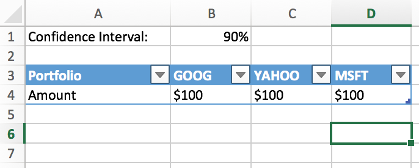

For the historic movements, I downloaded the opening prices of the stocks from [Google Finance](https://www.google.com/finance),
and worked out the percentage profit / loss for each day, like so:

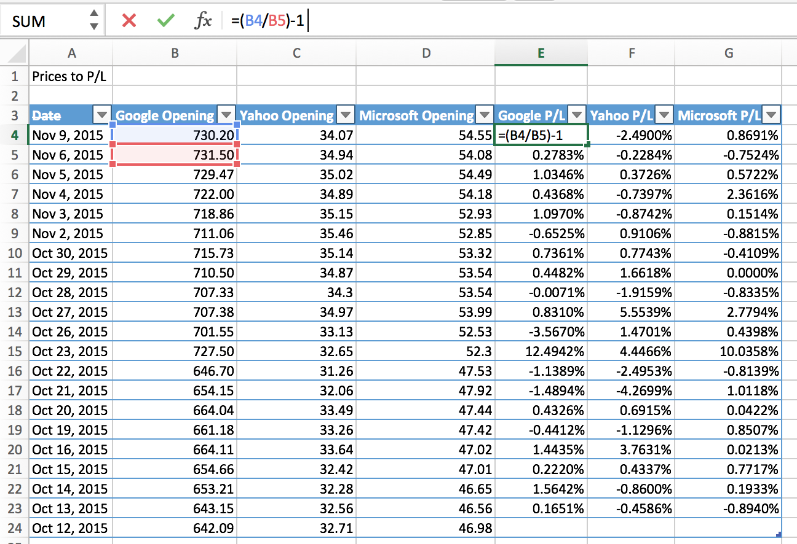

The graph of Profit / Loss looks like this:


So, the effect of converting opening prices to Profit / Loss essentially *normalizes* them all, meaning that the 
actual price of the share is irrelevant.  This means we can scale the profits/losses later to the size of our portfolio.

Now, no real VaR model would use *just 20 days* of PnL.  This is a *ridiculously short* time-frame, and there is a whole
art to choosing the time-frame to use, just on it's own.  20 days keeps the data size very manageable though, and 
hopefully means the screenshots will be clearer.

### The VaR Calculation

There are three steps to the calculation:

1.  Work out for the whole portfolio what the daily profit/loss would have been for each day, had we held it at that time.
2.  Order those profits and losses from lowest to highest.
3.  Take the result at the 90% point.  For our 20 days, this would be the second-worst result.

So, to do step 1, we need to multiply the holding of each share, by the profit / loss on that day.  So, let's do that:

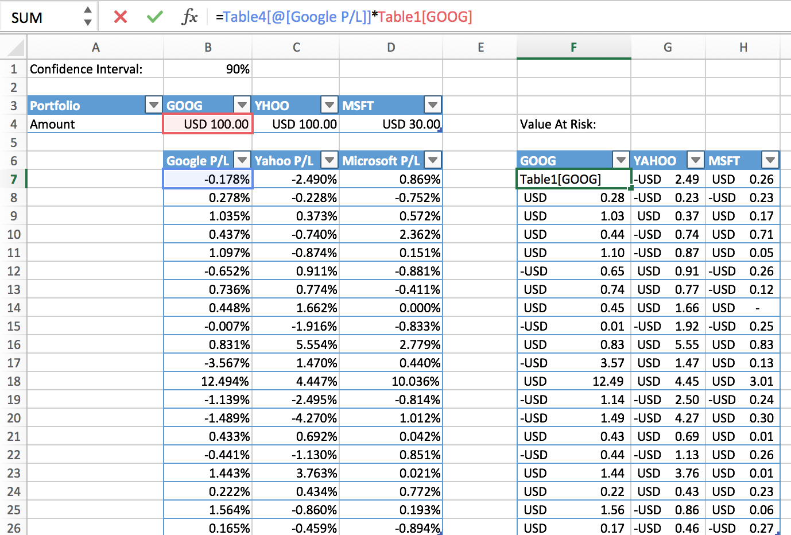

I've shown the formula in the screenshot - it's simply multiplying the size of the portfolio by the percentage profit / loss.

Next, I can calculate the overall portfolio profit / loss, simply by SUM'ing the columns:

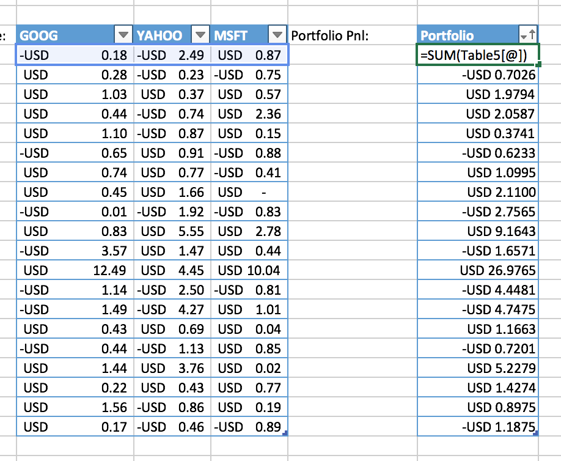

If I sort these returns, and graph them, you can see the distribution of profits and losses over time:

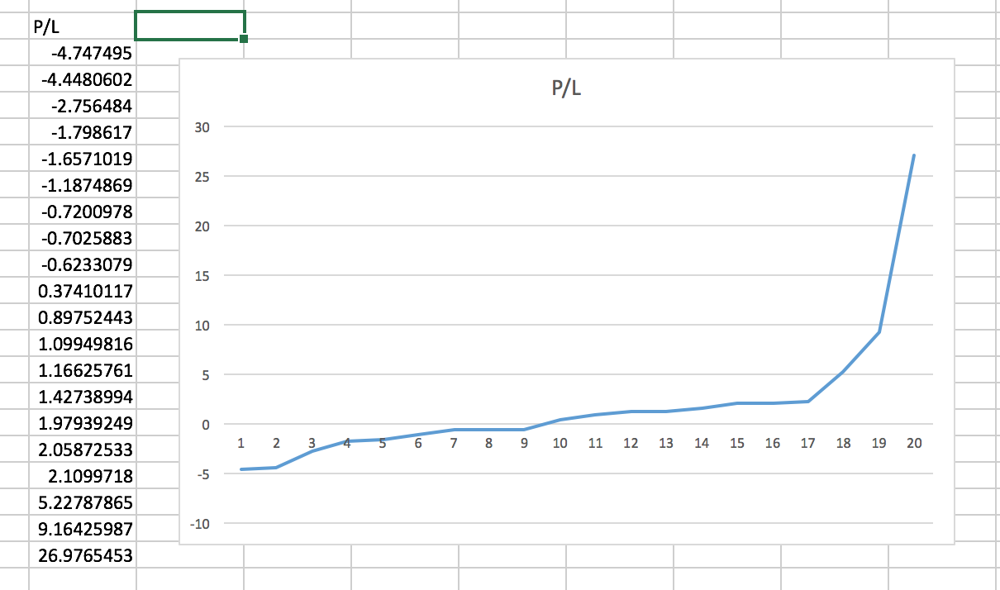

If only all investing were this profitable!  Some really big gains and a few small losses.  

Let's add the formula for this: `=SMALL(Table6[Portfolio], 20-C1*20)`, where B1 is the cell containing our confidence
interval (see pic below).  What this is doing is working out which of the points on the PnL distribution is our VaR
number.  Since it's a 90% VaR, and we have 20 numbers, we need the 2nd point.  (C1 contains our 90%).  

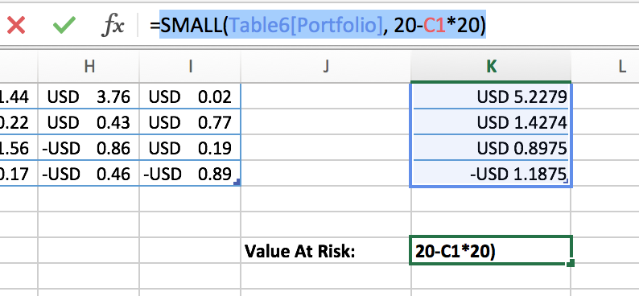

Our VaR works out to be around USD -4.448, as point 2 on the graph is at the 90% confidence interval.  

[You Can Download the Completed Spreadsheet Here](https://github.com/robmoffat/pure4j/blob/master/pure4j-examples/src/test/resources/org/pure4j/examples/var_model/ConcordionVar.xlsx?raw=true)

### Creating A Pure Java Implementation

Having done this as an Excel spreadsheet, we can now go on to build this as a Java project.  There are going to be:

* A `Sensitivity` value-object, which will hold the amount of each stock.  e.g. USD 100 of MSFT.
* A `PnLStream` value-object, which will hold the profit-and-loss amounts over a time-range.
* A `VarProcessor` interface and it's implementation.

These are all available in the Pure4J-examples project, if you want to examine them in more detail.

#### `Sensitivity`

Looks something like this:

```java
public final class Sensitivity extends AbstractImmutableValue<Sensitivity> {

	final String ticker;

	final float amount;
	
	public Sensitivity(String ticker, float amount) {
		super();
		this.ticker = ticker;
		this.amount = amount;
	}
	
	public String getTicker() {
		return ticker;
	}

	public float getAmount() {
		return amount;
	}

	@Override
	protected void fields(Visitor v, Sensitivity s) {
		v.visit(ticker, s.ticker);
		v.visit(amount, s.amount);
	}
```

Note the use of `AbstractImmutableValue`:  this class declares the `@ImmutableValue` needed to tell Pure4J to check this class,
and it also contains default implementations of `equals()`, `hashCode()`, `toString()` and `compareTo()` methods.  In return, the implementation needs to
define the `fields()` method to say what fields the class has. (See [Tutorial 1](tutorial1.md) for more details).  

#### `PnLStream` 

This is also a value object, so it starts like this:

```java
public class PnLStream extends AbstractImmutableValue<PnLStream> {

	final private IPersistentMap<LocalDate, Float> pnls;
	
	public IPersistentMap<LocalDate, Float> getPnls() {
		return pnls;
	}

	public PnLStream(IPersistentMap<LocalDate, Float> pnls) {
		super();
		this.pnls = pnls;
	}

	@Override
	protected void fields(Visitor v, PnLStream p) {
		v.visit(pnls, p.pnls);
	}

```

Since we are creating an immutable, value object, you can see that the `pnls` map contained within the stream uses
`IPersistentMap`.  This is an [immutable map implementation](tutorial_collections.md) available in Pure4J.

In order that we can do our VaR calculation, we need to be able to scale `PnLStream`s by a given `Sensitivity`, and
sum together a number of `PnLStream`s to get the position of our whole portfolio.  Let's look at those:

```java
	/**
	 * Merges two PnL Streams.  If "other" misses any dates present in this one, an exception is thrown.
	 * @param other
	 * @return A PnL stream the same length as the current one, with the same dates.
	 */
	public PnLStream add(PnLStream other) {
		PersistentHashMap<LocalDate, Float> added = PersistentHashMap.emptyMap();
		for (Entry<LocalDate, Float> entry : getPnls().entrySet()) {
			Float fo = other.getPnls().get(entry.getKey());
			if (fo == null) {
				throw new PnLStreamElementNotPresentException("For Date: "+entry.getKey());
			}
			
			added = added.assoc(entry.getKey(), fo + entry.getValue());
		}
		
		return new PnLStream(added);
	}
```

So, when you add one `PnLStream` to another, you get back the added `PnLStream`: there is no mutation of either of the 
original two streams.

Let's look at scaling the stream:

```java
	/**
	 * Scales up the PnLStream by factor f.
	 * @param f
	 * @return
	 */
	public PnLStream scale(float f) {
		PersistentHashMap<LocalDate, Float> added = PersistentHashMap.emptyMap();
		for (Entry<LocalDate, Float> entry : getPnls().entrySet()) {
			added = added.assoc(entry.getKey(), f * entry.getValue());
		}
		
		return new PnLStream(added);
	}
```

Again, scaling up creates a new `PnLStream` object which is returned: our classes remain immutable, which 
is what we want for thread-safe, pure java code.

#### The `VarProcessor`

Our interface looks like this:

```java
public interface VarProcessor {

	float getVar(IPersistentMap<String, PnLStream> historic, ISeq<Sensitivity> sensitivities);
}
```

Which is fairly self-explanatory.  Within our implementation, we set the VaR confidence interval:

```java
@ImmutableValue
public class VarProcessorImpl implements VarProcessor {
	
	private final float confidenceLevel;

	public VarProcessorImpl(float confidenceLevel) {
		this.confidenceLevel = confidenceLevel;
	}	
```

Again, we are constructing our Var processor as an immutable value object, but since I don't 
expect people to create collections of VarProcessors, I've not used `AbstractImmutableValue` here,
I've added the `@ImmutableValue` annotation instead.

#### `getVar()` Implementation

Let's work out the overall profit / loss stream for the portfolio.  
First, we multiply our sensitivities (the size of our portfolio) by the PnLStream's, and then 
sum them together, like so:

```java
public float getVar(IPersistentMap<String, PnLStream> historic, ISeq<Sensitivity> sensitivities) {
		// combine the sensitivities
		PnLStream combined = null;
		for (Sensitivity s : sensitivities) {
			String t = s.getTicker();
			// find the right PnL Stream for the sensitivity
			PnLStream theStream = historic.get(t);
			
			// scale it
			float scale = s.getAmount();			
			PnLStream scaledStream = theStream.scale(scale);
			
			// sum it with the others
			combined = (combined == null) ? scaledStream : combined.add(scaledStream);
		}
```

Having created the `combined`, scaled `PnLStream`, we can now do our percentile calculation on it:

```java
		// collect the results + sort (probably highly inefficient)
		Stream<Float> stream = combined.getPnls().values().stream();
		Collector<Float, List<Float>, IPersistentList<Float>> collector = PureCollectors.toPersistentList();
		IPersistentList<Float> results = stream.collect(collector);
		IPersistentVector<Float> sorted = PureCollections.sort(results.seq());
		
		// work out confidence level
		float members = sorted.size();
		float index = members * confidenceLevel;
		
		return sorted.get((int) index);
		
```

### Using Concordion To Build The Test

First, we have to declare the dependency on the Concordion Excel Extension. In Maven, this would be:

```xml
		<dependency>
			<groupId>org.concordion</groupId>
			<artifactId>concordion-excel-extension</artifactId>
	        <version>1.0.7</version> <!-- or whatever is the latest -->
	        <scope>test</scope>
		</dependency>
```

Then we can begin to define our test.  There are going to be two parts, the java class, and the Excel spreadsheet.
Our java class is called `ConcordionVarTest.java`, and our Excel spreadsheet must be called `ConcordionVarTest.xlsx`,
in the same package structure (but in the `src/test/resources`directory), like so:

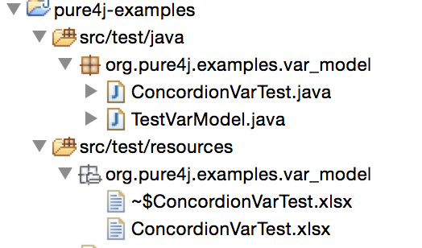

### `ConcordionVarTest.java`

We've already seen how to build the Excel Spreadsheet part, and so next we need to build the Java Fixture.  The responsibilities
of this class are:

* To collect up the inputs off the spreadsheet into Java Objects.
* To call the `VarProcessorImpl` with those inputs.
* To return the output from the `VarProcessorImpl` back to concordion.

The inputs that we have to process are going to be:

* The confidence interval (of 90%) 
* The size of the sensitivity in each of our stocks
* The historic PnL Stream for each stock.  

#### Setting The Confidence Interval & Calling The VaR Processor


`ConcordionVarTest` starts like this:

```java
@RunWith(ConcordionRunner.class)
@Extensions(ExcelExtension.class)
public class ConcordionVarTest {
	
	IPersistentMap<String, PnLStream> theStreams = new PersistentHashMap<String, PnLStream>();
	IPersistentList<Sensitivity> sensitivities = new PersistentList<Sensitivity>();
	
	public String calculateVaR(String percentage) {
		float conf = parsePercentage(percentage);
		VarProcessor processor = new VarProcessorImpl(conf);
		float result = processor.getVar(theStreams, sensitivities.seq());
		return new DecimalFormat("#.000").format(result);
	}
	
	private float parsePercentage(String percentage) {
		return Float.parseFloat(percentage.trim().substring(0, percentage.trim().length()-1)) / 100f;
	}
```

Let's go through some of the important features here:

* The `RunWith` is a **JUnit annotation**.  This means that Concordion tests are actually a type of JUnit Test.  This is nice, because IDEs like Eclipse offer
a lot of support for JUnit.
* The `Extensions` indicates that this is going to use an **Excel** format test.  Since our test is called "ConcordionVarTest", Concordion will drop the "Test" part and look for a file called "ConcordionVaR.xlsx" in the classpath.
* `calculateVaR` is the main test method here.  It takes a percentage argument.  It's calling our `VarProcessorImpl`, and using some local variables from the test as the arguments (so, we also need to set
those up).
* Concordion expects text-based parameters.  So, the percentage is passed in from the spreadsheet as text, and we return the result as text, hence the `parsePercentage` method.

#### Getting Concordion To Call `calculateVaR`

To do this, we add some comments into the Excel spreadsheet, which concordion can interpret.  First, to set the confidence interval:

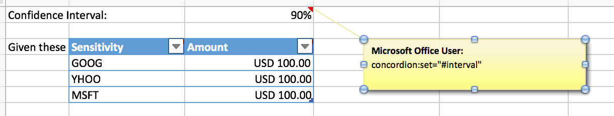

This uses the `concordion:set` command, to set a concordion variable called `#interval` to whatever is in the cell.

And then to call the `calculateVaR` method:

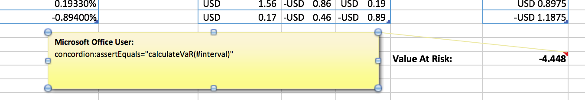

Which uses `concordion:assertEquals`.  What this does is execute the java method in the double-quotes, replacing `#interval` from the concordion variable we set.  
Once we get the result back, this is compared to the contents of the cell.  If they are the same, then in our HTML report, the result will be a pass (i.e. green).

#### Setting `theStreams` and `sensitivities`

This is a bit more complicated.  What we are going to do is use concordion's table-row processing capabilities to set up these variables one table row at a time.  We are
again going to use `concordion:set` to set a variable, and also `concordion:execute` to execute some java:

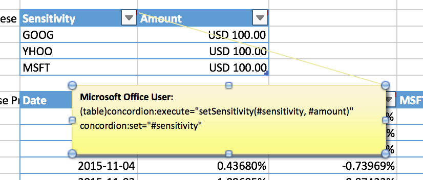

So here, (in the header row) we are setting up two things:  one is a variable called `#sensitivity`, and the other is a command to say, for each row of the table, 
execute the Java `setSensitivity()` method.

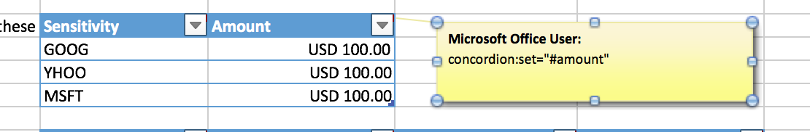

For the other cell, the `#amount` is also set, so the `setSensitivity()` command is executed for each row of the table, and takes both columns.  Here is the 
code for that, again from our Java `ConcordionVarTest` class:

```java
	public void setSensitivity(String ticker, String amount) {
		Float f = Float.parseFloat(amount.substring(amount.lastIndexOf("]")+1));
		sensitivities = sensitivities.cons(new Sensitivity(ticker, f));
	}
```

As you can see, we simply `cons` on a new sensitivity into the list for each row.  


